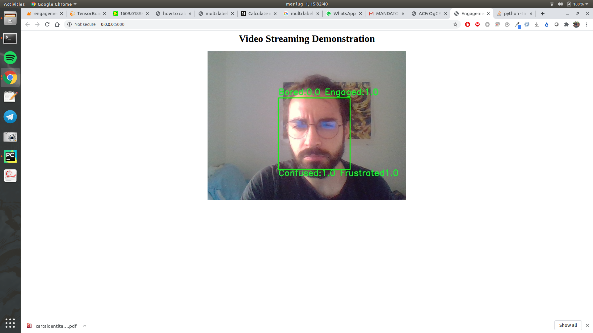

# DAiSEE Engagement Recognition
Implementation in Tensorflow 2.x of Engagement Recognition using DAiSEE dataset

Engagement Recognition is made through a multi-label classification of the following status:
- engaged
- bored
- frustrated 
- confused

This implementation comes with a camera script so to test it using your webcam.

## Dataset
Get the DAiSEE dataset from this page: https://people.iith.ac.in/vineethnb/resources/daisee/index.html   
Run extractFrames.py script and hog.py to extract the features.

## Installation
You can install dependencies as usual using pip install -r requirements.txt   
Then you need to preprocess the dataset by running daisee_data_preprocessing.py script.   
Afterwards run train.py to train the model and test it using main.py script   
